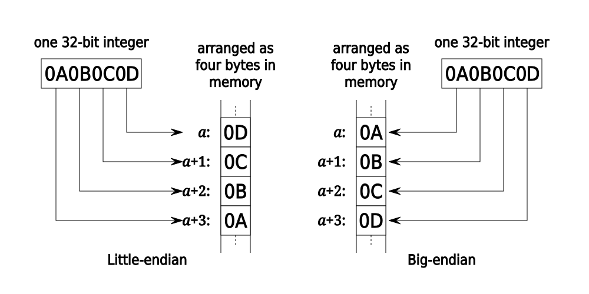
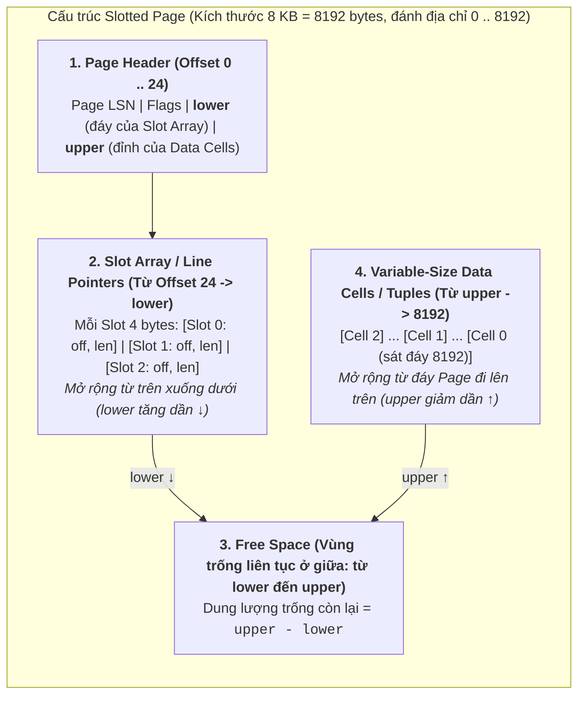
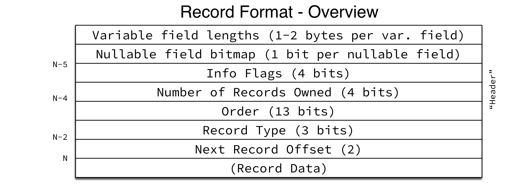
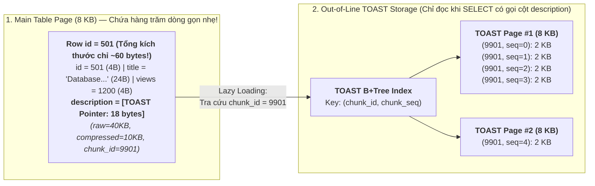

## Table of Contents
0. [Khởi động cho người mới: Hành trình từ câu lệnh INSERT đến mảng Byte trên đĩa](#beginner-warmup)
1. [Binary Encoding (Mã hóa nhị phân: Endianness, Varint, String, Null Bitmap)](#binary-encoding)
2. [Cấu trúc Page tổng quát và Slotted Pages](#slotted-pages)
3. [Ví dụ chạy tay (Step-by-Step Dry Run): Vòng đời một Slotted Page 8192 bytes](#slotted-page-dry-run)
4. [Cấu trúc Cell (Key Cells vs Key-Value Data Cells & Truy cập cột O(1))](#cell-layout)
5. [Quản lý dữ liệu kích thước lớn và Overflow Pages (TOAST)](#overflow-pages)
6. [Quản lý phiên bản File Format & Checksum (Versioning)](#versioning)
7. [Tóm tắt & Ghi nhớ cốt lõi (Key Takeaways)](#key-takeaways)

---

## Khởi động cho người mới: Hành trình từ câu lệnh INSERT đến mảng Byte trên đĩa {#beginner-warmup}

### 1. Ẩn dụ đời thực: Khi câu lệnh `INSERT INTO users VALUES (101, 'Alice', 28)` chạm tới ổ cứng
Ở Chương 2, cây B+Tree đã được giới thiệu dưới góc nhìn logic gồm các Node và các con trỏ. Tuy nhiên, phần cứng ổ đĩa (HDD/SSD) không hề hiểu khái niệm "Bảng", "Cột", "Node" hay "Con trỏ" — ổ đĩa chỉ biết đọc và ghi các mảng byte thô (`0` và `1`) theo từng khối cố định gọi là **Page** (`4 KB`, `8 KB` hoặc `16 KB`).

Hãy tự hỏi: Khi lập trình viên gõ câu lệnh SQL quen thuộc:

```sql
INSERT INTO users (id, name, age, bio) VALUES (101, 'Alice', 28, NULL);
```

Làm thế nào **PostgreSQL** (dùng Page `8 KB = 8.192 bytes`) hay **MySQL InnoDB** (dùng Page `16 KB = 16.384 bytes`) biến 4 cột dữ liệu trừu tượng trên thành các byte nằm gọn trong file trên đĩa?

- **Hãy tưởng tượng mỗi `Page` (`8 KB` / `16 KB`) giống như một Toa tàu chở hàng có đánh số ghế ở đầu toa và chất thùng hàng ở cuối toa (`Slotted Page`)**:
  1. **Đóng gói từng món hàng vào một chiếc Hộp kín (`Cell / Tuple` — Mã hóa nhị phân)**:
     - Trước khi đưa lên toa tàu, nhân viên đóng gói phải ép 4 giá trị `(101, 'Alice', 28, NULL)` thành một dãy byte liên tục gọn nhất có thể:
     - Cột `bio` là `NULL`? Thay vì tốn chỗ ghi chữ `"NULL"`, nhân viên chỉ cần bật `1 bit` trên tờ phiếu kiểm kê ở nắp hộp (**`Null Bitmap`**) để báo *"Cột thứ 4 trống!"*, và không tốn thêm bất kỳ byte nào cho `bio`!
     - Con số `id = 101` và `age = 28` được dịch sang mã nhị phân cố định (`4 bytes`), còn chữ `'Alice'` là chuỗi co giãn (**`Variable-Size Field`**) nên được ghi kèm con số báo độ dài `5 bytes` ở phía trước.
  2. **Xếp hộp hàng vào cuối toa tàu và ghi sổ mục lục ở đầu toa (`Slotted Page`)**:
     - Thay vì xếp các hộp hàng nối đuôi nhau từ đầu toa (vì nếu hành khách ở giữa hủy vé `DELETE` hoặc đổi sang hộp hàng to hơn `UPDATE`, cả đoàn tàu sẽ phải khuân vác dịch chuyển lại hàng trăm hộp hàng phía sau!), kỹ sư Database dùng một mẹo cực kỳ thông minh:
     - **Ở đầu toa tàu (ngay sau buồng lái `Page Header`)**: Đặt một **Bảng danh sách số thứ tự ngăn (`Line Pointer / Slot Offset Array`)** mọc dần từ trái sang phải. Mỗi ô trong bảng này chỉ tốn `2 – 4 bytes` để ghi tọa độ: *"Hộp hàng số 1 đang đặt ở mét thứ `8050` dưới cuối toa"*.
     - **Ở cuối toa tàu**: Các hộp hàng thực tế (`Cells / Tuples`) được **chất chồng từ đáy toa ngược lên phía đầu toa**.
     - Nhờ vậy, khoảng trống ở chính giữa toa tàu luôn là một vùng trống liền mạch. Nếu hộp hàng số 1 bị xóa hoặc dời chỗ, nhân viên chỉ việc sửa lại con số tọa độ trong Bảng danh sách ở đầu toa mà không làm xáo trộn địa chỉ của các hộp hàng khác!
  3. **Nếu gặp một kiện hàng siêu trường siêu trọng 40 KB (`Overflow Page / TOAST`)**:
     - Toa tàu chỉ dài `8 KB`, không thể nhét vừa một bài báo dài `40 KB`. Hệ thống sẽ tự động nén bài báo đó lại, cắt thành các kiện nhỏ `2 KB` đem cất sang một **toa tàu phụ chuyên chở hàng quá khổ (`Overflow Page / TOAST Table`)**, rồi chỉ để lại trong toa chính một **tấm vé gửi đồ nhỏ xíu (`18 bytes` TOAST Pointer)** ghi địa chỉ các kiện hàng kia!

---

### 2. Bảng Từ Điển Thuật Ngữ Nhanh Cho Người Mới (Beginner's Visual Glossary)

Trước khi đi vào chi tiết từng bit và byte của Chương 3, người đọc hãy nắm nhanh 8 thuật ngữ nền tảng qua bảng đối chiếu dưới đây:

| Thuật ngữ trong sách | Hiểu nôm na cho người mới (Ẩn dụ đời thực) | Trong Database thực tế (PostgreSQL / MySQL InnoDB / SQLite) là gì? |
| :--- | :--- | :--- |
| **`Primitive Serialization & Endianness` (`Big-Endian` vs `Little-Endian`)** | Cách viết một con số nhiều chữ số ra giấy: viết từ hàng lớn nhất xuống hàng đơn vị (`Big-Endian`) hay viết ngược từ hàng đơn vị lên (`Little-Endian`). | CPU `x86_64`/`ARM64` lưu số trong RAM theo `Little-Endian`, nhưng khi lưu khóa Index xuống đĩa (InnoDB, RocksDB), hệ thống thường đổi sang **`Big-Endian`** để hàm `memcmp` so sánh từng byte từ trái sang phải đúng thứ tự lớn nhỏ ngay lập tức. |
| **`Page / Slotted Page`** | "Toa tàu hai đầu": đầu trên chứa bảng danh sách chỉ mục nhỏ gọn mọc đi xuống, đầu dưới chứa các kiện hàng dữ liệu mọc đi lên, ở giữa là khoảng trống. | Cấu trúc trang chuẩn mực của hầu hết RDBMS: trang `8 KB` của PostgreSQL và trang `16 KB` của MySQL InnoDB đều là các biến thể của **Slotted Page**. |
| **`Page Header`** | "Bảng thông tin buồng lái" ở ngay đầu mỗi trang, ghi số hiệu trang, loại trang, mã kiểm tra lỗi và vị trí ranh giới vùng trống. | Trong PostgreSQL là `PageHeaderData` (`24 bytes` đầu trang: `pd_lsn`, `pd_checksum`, `pd_lower`, `pd_upper`); trong InnoDB là `FIL Header` (`38 bytes`) + `INDEX Header` (`36 bytes`). |
| **`Line Pointer / Offset Array` (Mảng con trỏ vị trí)** | "Bảng sơ đồ ngăn tủ" ở đầu trang: mỗi ô đánh số thứ tự `0, 1, 2...` và chỉ lưu số byte (`offset`) dẫn tới vị trí thực của dòng dữ liệu dưới đáy trang. | Trong PostgreSQL gọi là mảng **`ItemIdData` (`Line Pointers`, `4 bytes`/ô)**; trong SQLite gọi là **`Cell Pointer Array` (`2 bytes`/ô)**; trong InnoDB là **`Page Directory`**. |
| **`Cell / Tuple` (Bản ghi nhị phân)** | "Chiếc hộp hàng đã đóng gói kín": một dòng dữ liệu sau khi đã ép tất cả các cột thành một dãy byte liên tiếp đặt ở đáy trang. | Sách *Database Internals* và SQLite gọi là **`Cell`**; PostgreSQL gọi là **`Heap Tuple` / `Index Tuple`**; MySQL InnoDB gọi là **`Record`** (`Compact` / `Dynamic` record format). |
| **`Null Bitmap` (Mảng bit đánh dấu cột `NULL`)** | "Phiếu tích chọn `NULL`": một dãy công tắc mà mỗi cột chỉ tốn đúng `1 bit` (`1` = cột này bị `NULL`, `0` = có dữ liệu). Cột nào `NULL` thì khỏi cần đóng gói. | Nằm ngay phần đầu của mỗi `Tuple/Record` trong cả PostgreSQL (`t_bits`) và MySQL InnoDB (`Nullable field bitmap`), giúp các cột `NULL` tốn **`0 byte`** ở vùng dữ liệu. |
| **`Variable-Size Fields` (Trường độ dài thay đổi)** | Các món hàng co giãn như tên người, địa chỉ, chuỗi JSON (`VARCHAR`, `TEXT`) — bắt buộc phải ghi kèm chiều dài thực tế ở đầu bản ghi. | PostgreSQL dùng cấu trúc `varlena` (ghi độ dài ở đầu trường); InnoDB gom danh sách độ dài các cột `VARCHAR` đặt ở đầu Record (`Variable field lengths` `1–2 bytes`/cột). |
| **`Overflow Page / TOAST` (Trang tràn cho dữ liệu siêu lớn)** | "Kho gửi đồ quá khổ": khi một cột văn bản/ảnh quá to không nhét vừa trang chính, hệ thống cắt nhỏ đem cất sang trang phụ và chỉ giữ lại tấm vé hẹn `18–20 bytes`. | PostgreSQL gọi là **`TOAST`** (*The Oversized-Attribute Storage Technique* — kích hoạt khi dòng `> 2 KB`); MySQL InnoDB gọi là **`Off-Page / Overflow Pages`** (`20-byte BOB pointer`); SQLite gọi là **`Overflow Pages`**. |

---

## Binary Encoding (Mã hóa nhị phân: Endianness, Varint, String, Null Bitmap) {#binary-encoding}

### Bài toán thực tế: Tại sao không lưu dữ liệu dưới dạng Text (JSON / CSV) trong Page?
Giả sử lưu dòng dữ liệu `{"id": 1000000, "active": true, "name": "Alice"}` dưới dạng chuỗi JSON thuần túy:
1. **Lãng phí dung lượng**: Con số `1000000` ở dạng văn bản ASCII tốn `7 bytes` (và lặp lại tên trường `"id":` ở mọi dòng), trong khi bản chất số nguyên 32-bit chỉ tốn `4 bytes`.
2. **Không thể nhảy trực tiếp đến cột thứ $k$ với độ phức tạp $\mathcal{O}(1)$**: Muốn đọc trường `"name"`, CPU buộc phải quét từng byte từ đầu dòng, đếm từng dấu ngoặc kép `"` và dấu phẩy `,` ($\mathcal{O}(N)$ parsing overhead).

Để đạt hiệu năng cao nhất, Storage Engine mã hóa mọi kiểu dữ liệu nguyên thủy sang định dạng **Nhị phân có cấu trúc chặt chẽ (Structured Binary Encoding)**.

---

### 1. Số nguyên kích thước cố định (Fixed-Width Integers) & Thứ tự Byte (`Endianness`)
Các số nguyên có kích thước cố định (`INT8 = 1 byte`, `INT16 = 2 bytes`, `INT32 = 4 bytes`, `INT64 = 8 bytes`) khi trải ra mảng byte trong bộ nhớ hoặc trên đĩa có thể xếp theo hai thứ tự ngược nhau:

> [!NOTE]
> **Cách đọc sơ đồ cho người mới:**
> 1. **Nhìn vào hai thanh ngang `"one 32-bit integer"` ở phía trên**: Số nguyên 32-bit `0x0A0B0C0D` gồm 4 byte: byte lớn nhất (MSB) là `0A` (bên trái) và byte nhỏ nhất (LSB) là `0D` (bên phải).
> 2. **Theo dõi các mũi tên đi vào cột bộ nhớ dọc (`a, a+1, a+2, a+3`) ở hai nửa hình**:
>    - **Bên trái (`Little-endian`)**: Các mũi tên bắt chéo ngược — byte nhỏ nhất `0D` được xếp vào ô địa chỉ đầu tiên `a`, còn byte lớn nhất `0A` bị đẩy xuống cuối ở `a+3` (`0D -> 0C -> 0B -> 0A`).
>    - **Bên phải (`Big-endian`)**: Các mũi tên đi thẳng theo đúng thứ tự tự nhiên — byte lớn nhất `0A` nằm ngay ở ô đầu tiên `a`, tiếp theo là `0B`, `0C`, `0D`.
> 3. **Kết quả**: Khi so sánh hai khóa từ địa chỉ đầu tiên `a` trở đi bằng hàm `memcmp`, chỉ có **`Big-endian`** mới so sánh byte hàng triệu (`0A`) trước byte hàng đơn vị (`0D`), đảm bảo kết quả so sánh byte trùng khớp 100% với thứ tự lớn nhỏ của con số!



- **Big-Endian (*Most Significant Byte First — MSB First*)**: Byte có trọng số lớn nhất đứng ở địa chỉ đầu tiên (bên trái). Ví dụ số 32-bit `0x12345678` được lưu lần lượt là `12 34 56 78` (giống hệt cách con người viết số từ hàng triệu xuống hàng đơn vị).
- **Little-Endian (*Least Significant Byte First — LSB First*)**: Byte có trọng số nhỏ nhất đứng ở địa chỉ đầu tiên. Số `0x12345678` được lưu ngược thành `78 56 34 12`. Đây là định dạng gốc của kiến trúc vi xử lý `x86_64` và `ARM64` hiện đại.

#### Tại sao Big-Endian lại cực kỳ quan trọng khi mã hóa Khóa chỉ mục (Index Keys) để so sánh bằng `memcmp`?
Trong B+Tree hoặc LSM-Tree, mỗi lần tìm kiếm một khóa, CPU phải thực hiện hàng chục phép so sánh giữa các khóa. Thay vì phải giải mã (deserialize) từng khóa nhị phân ra kiểu dữ liệu gốc (`INT32`, `INT64`, `VARCHAR`) rồi mới so sánh, các Storage Engine (như RocksDB, MySQL InnoDB, SQLite) muốn dùng thẳng hàm **`memcmp(key1, key2, len)`** (so sánh từng byte thô từ trái sang phải bằng lệnh vector hóa của CPU) cho mọi loại khóa!

Hãy xem điều gì xảy ra nếu so sánh hai số nguyên 16-bit là **`1` (`0x0001`)** và **`256` (`0x0100`)** bằng `memcmp` (so sánh byte đầu tiên bên trái trước):

```text
+---------------+-------------------------+-------------------------+-----------------------------------+
| Giá trị số    | Biểu diễn Big-Endian    | Biểu diễn Little-Endian | Kết quả so sánh byte đầu (memcmp) |
+---------------+-------------------------+-------------------------+-----------------------------------+
| Số nhỏ:   1   | [ 0x00, 0x01 ]          | [ 0x01, 0x00 ]          | - Big-Endian: 0x00 < 0x01 (ĐÚNG!) |
| Số lớn: 256   | [ 0x01, 0x00 ]          | [ 0x00, 0x01 ]          | - Little-Endian: 0x01 > 0x00      |
|               |                         |                         |   -> Báo 1 > 256 (SAI THỨ TỰ!)    |
+---------------+-------------------------+-------------------------+-----------------------------------+
```

> [!TIP]
> **Mẹo kỹ thuật trong InnoDB & RocksDB (Byte-Orderable Encoding)**:
> Để `memcmp` trả về đúng thứ tự số học từ nhỏ đến lớn:
> 1. Phải lưu khóa số nguyên theo chuẩn **Big-Endian** (để byte bậc cao được so sánh trước).
> 2. Với **số nguyên có dấu (Signed Integers — bù 2 / Two's Complement)**, số âm luôn có bit dấu đầu tiên bằng `1` (ví dụ `-1 = 0xFFFFFFFF`), còn số dương có bit dấu bằng `0` (ví dụ `+1 = 0x00000001`). Nếu chạy `memcmp` trực tiếp, `0xFF > 0x00` nên số âm sẽ bị coi là lớn hơn số dương! Để khắc phục, trước khi lưu khóa xuống đĩa, Storage Engine chỉ cần **đảo bit đầu tiên (Flip the Sign Bit — `XOR 0x80000000`)**: lúc này `-1` biến thành `0x7FFFFFFF` và `+1` biến thành `0x80000001`, giúp hàm `memcmp` so sánh đúng tuyệt đối cả số âm lẫn số dương!

---

### 2. Số nguyên độ dài thay đổi: `Varint` / `LEB128` (Variable-Length Integer)
- **Bài toán thực tế**: Trong các cấu trúc nội bộ của Page (như lưu độ dài chuỗi `VARCHAR`, lưu `Row ID`, hoặc lưu độ lệch `Offset`), 99% các con số đều rất nhỏ (ví dụ chuỗi dài `5` đến `100 bytes`). Nếu lúc nào cũng cấp cứng một kiểu `UINT64` (`8 bytes`) cho một con số có giá trị bằng `5` (`00 00 00 00 00 00 00 05`), hệ thống sẽ lãng phí `7 bytes` chứa toàn số `0` vô nghĩa!
- **Giải pháp `Varint` (*Base-128 Variable-Length Encoding / LEB128* — dùng trong SQLite, RocksDB, Protocol Buffers)**:
  - Thay vì cố định số byte, `Varint` chia mỗi byte (`8 bits`) thành 2 phần:
    - **1 bit đầu tiên (MSB — Continuation Bit)**: Đóng vai trò là cờ báo hiệu:
      - Nếu $\text{MSB} = \mathbf{1}$: *"Vẫn còn byte tiếp theo thuộc về con số này, hãy đọc tiếp!"*
      - Nếu $\text{MSB} = \mathbf{0}$: *"Đây là byte cuối cùng của con số này, dừng lại!"*
    - **7 bits còn lại (Payload Bits)**: Chứa giá trị nhị phân thực sự của con số.
  - Nhờ đó, mọi số từ `0` đến `127` ($2^7 - 1$) chỉ tốn đúng **`1 byte`**; số từ `128` đến `16.383` ($2^{14} - 1$) chỉ tốn **`2 bytes`**!

#### Ví dụ chạy tay từng bit: Mã hóa con số `300` sang `Varint (LEB128)` thành `2 bytes`
Giả sử cần lưu độ dài của một cột văn bản là **`300` bytes** theo chuẩn Little-Endian Base-128 (`LEB128`):

1. **Bước 1 — Đổi số `300` sang hệ nhị phân**:
   - Biểu diễn nhị phân: $300 = 256 + 32 + 8 + 4 = \mathbf{100101100_2}$ (gồm `9 bits`).
2. **Bước 2 — Cắt thành từng nhóm `7 bits` từ phải sang trái (từ bit trọng số thấp đến cao)**:
   - Nhóm 7 bits thấp (bên phải): `0101100` (tương ứng giá trị $32 + 8 + 4 = 44$).
   - Nhóm 7 bits cao (bên trái, thêm các số `0` ở đầu cho đủ 7 bits): `0000010` (tương ứng giá trị $2 \times 128 = 256$).
3. **Bước 3 — Gắn bit cờ tiếp nối (`Continuation Bit - MSB`) vào đầu mỗi nhóm 7 bits**:
   - **Byte thứ nhất** (chứa nhóm 7 bits thấp `0101100`): Vì phía sau vẫn còn nhóm nữa nên gắn bit đầu $\text{MSB} = \mathbf{1}$:
     $\implies \mathbf{1}\text{0101100}_2 = \text{0xAC}$ (`172` thập phân).
   - **Byte thứ hai** (chứa nhóm 7 bits cao `0000010`): Vì đây là byte cuối cùng nên gắn bit đầu $\text{MSB} = \mathbf{0}$:
     $\implies \mathbf{0}\text{0000010}_2 = \text{0x02}$ (`2` thập phân).

```text
[Quá trình mã hóa số 300 (nhị phân: 100101100) thành 2 bytes Varint (LEB128)]

Giá trị nhị phân 9-bit:           10   0101100
                                  ||   |||||||
Tách thành 2 nhóm 7-bit:     0000010   0101100
                             (Nhóm 2)  (Nhóm 1 - Trọng số thấp)

Đặt Nhóm 1 lên Byte đầu (gắn MSB = 1 vì còn tiếp) và Nhóm 2 ở Byte sau (gắn MSB = 0 vì kết thúc):
+------------------------------------+------------------------------------+
| Byte 0: [1] 0 1 0 1 1 0 0  (0xAC)  | Byte 1: [0] 0 0 0 0 0 1 0  (0x02)  |
+---------^^^------------------------+---------^^^------------------------+
           |                                    |
   MSB = 1 (Đọc tiếp byte sau)          MSB = 0 (Byte cuối cùng -> Dừng!)

Kiểm tra giải mã ngược: (0101100_2) + (0000010_2 << 7) = 44 + (2 * 128) = 44 + 256 = 300!
```

---

### 3. Chuỗi ký tự (`VARCHAR` / `BLOB`) và `Null Bitmap`
- **Chuỗi ký tự độ dài thay đổi (Length-Prefixed Strings / Pascal Strings)**:
  - Trong ngôn ngữ C, chuỗi được kết thúc bằng byte `0x00` (`Null-terminated string`). Tuy nhiên Database không dùng cách này vì: (1) Muốn biết chuỗi dài bao nhiêu phải chạy vòng lặp đếm từng byte $\mathcal{O}(N)$, và (2) Không thể lưu dữ liệu nhị phân (`BLOB`/`BYTEA`) có chứa byte `0x00` hợp lệ ở giữa.
  - Thay vào đó, Database luôn lưu **Độ dài chuỗi (`Length` — thường mã hóa bằng `Varint` hoặc `2-4 bytes` integer)** ngay phía trước mảng byte nội dung: `[Length][UTF-8 Payload Bytes]`.
- **Null Bitmap (Mặt nạ bit quản lý giá trị `NULL`)**:
  - **Bài toán**: Nếu một bảng có 32 cột nhưng trong một bản ghi cụ thể có tới 20 cột mang giá trị `NULL`, làm sao để không tốn một byte dữ liệu nào cho 20 cột `NULL` đó?
  - **Giải pháp**: Đặt ở đầu mỗi bản ghi một mảng bit gọi là **Null Bitmap**, trong đó mỗi cột của bảng chỉ chiếm đúng **`1 bit`** (32 cột chỉ tốn $32 / 8 = 4\text{ bytes}$). Nếu bit thứ $i$ cho biết cột $i$ là `NULL`, cột đó được **bỏ qua hoàn toàn** trong phần dữ liệu phía sau!

#### Ví dụ tổng hợp: Đóng gói nhị phân một bản ghi hoàn chỉnh
Xét bảng `users(id INT32, name VARCHAR, active BOOLEAN, bio VARCHAR)` với bản ghi:
- `id = 42` (`0x0000002A` theo Big-Endian)
- `name = "Alice"` (`5 bytes` ASCII: `41 6C 69 63 65`)
- `active = true` (`0x01`)
- `bio = NULL`

Bố cục từng byte liên tiếp (Contiguous Byte Layout) của bản ghi này chỉ chiếm đúng **`13 bytes`**:

| Thành phần | Kích thước | Giá trị Hex | Giải thích kỹ thuật chi tiết |
| :--- | :--- | :--- | :--- |
| **1. Null Bitmap** | `1 byte` | `0x08` (`00001000` nhị phân) | Bit thứ `3` (`0-indexed`, ứng với cột thứ 4 là `bio`) bằng `1` báo hiệu `bio IS NULL`. Các bit `0, 1, 2` đều bằng `0` (khác `NULL`). |
| **2. Fixed: `id`** | `4 bytes` | `00 00 00 2A` | Giá trị `42` kiểu `INT32` (Big-Endian). Đặt cố định ngay sau Null Bitmap. |
| **3. Fixed: `active`** | `1 byte` | `01` | Giá trị `true`. Gom toàn bộ các cột kích thước cố định lên đầu giúp tính địa chỉ byte bằng phép cộng $\mathcal{O}(1)$. |
| **4. Var Offset/Len** | `2 bytes` | `00 05` | Độ dài (hoặc vị trí kết thúc) của cột biến đổi đầu tiên (`name` dài `5 bytes`). Cột `bio` là `NULL` nên không cần lưu! |
| **5. Var Data: `name`**| `5 bytes` | `41 6C 69 63 65` | 5 ký tự ASCII `"Alice"`. Cột `bio` tốn **`0 bytes`** ở vùng dữ liệu! |

---

## Cấu trúc Page tổng quát và Slotted Pages {#slotted-pages}

### Bài toán thực tế: Điều gì xảy ra nếu xếp các dòng dữ liệu nối đuôi nhau trực tiếp từ đầu Page?
Giả sử có một Page `8 KB` (`8.192 bytes`). Nếu thiết kế theo cách ngây thơ là cứ chèn bản ghi thứ nhất ở đầu trang (`offset 0..200`), bản ghi thứ hai nối tiếp ngay sau (`offset 200..400`), bản ghi thứ ba ở (`offset 400..700`), hệ thống sẽ vấp phải **3 bài toán bế tắc**:

1. **Xóa dữ liệu gây phân mảnh lỗ chỗ (External Fragmentation)**:
   - Khi xóa bản ghi thứ hai ở giữa (`offset 200..400`), nó để lại một "lỗ thủng" rộng `200 bytes`. Nếu bản ghi mới cần chèn vào nặng `250 bytes`, lỗ thủng này không nhét vừa và bị bỏ hoang!
2. **Cập nhật làm phình kích thước bản ghi (`UPDATE` mở rộng chuỗi)**:
   - Nếu sửa tên khách hàng ở bản ghi thứ nhất làm kích thước của nó tăng từ `200 bytes` lên `300 bytes`, nó không thể phình ra tại chỗ vì ngay sát byte `200` đã bị bản ghi thứ hai chiếm đóng!
3. **Thảm họa hỏng con trỏ Secondary Index khi dồn trang (Compaction)**:
   - Để gom các lỗ thủng lại hoặc dời bản ghi đi chỗ khác trong trang, địa chỉ byte vật lý (`Byte Offset`) của các bản ghi trong Page sẽ bị thay đổi. Nếu các cây chỉ mục (Secondary Index) bên ngoài đang lưu địa chỉ `(Page 10, ByteOffset 400)`, mỗi lần dồn trang hoặc dịch chuyển 1 dòng trong Page sẽ buộc phải đi sửa lại toàn bộ các Index trên bảng!

### Giải pháp kinh điển: Cấu trúc Slotted Page (Dùng trong PostgreSQL, InnoDB, SQLite)
**Slotted Page** giải quyết triệt để cả 3 vấn đề trên bằng hai ý tưởng thiết kế xuất sắc:
1. **Thêm một tầng gián tiếp (`Indirection Layer` — `Slot Array` / `Line Pointer Directory`)**: Các Index bên ngoài **không bao giờ lưu địa chỉ `Byte Offset` trực tiếp**, mà chỉ lưu chỉ số thứ tự của ô trong mảng **`Slot ID`** (`TID = (PageID, SlotID)`). Bản thân `Slot[i]` mới lưu `(offset, length)` trỏ tới vị trí byte thực tế của bản ghi trong Page!
2. **Cho hai đầu mọc ngược chiều nhau vào vùng trống ở giữa**:
   - **Mảng `Slot Array`** nằm ở đầu trang (ngay dưới `Page Header`) và **mọc từ trên xuống dưới** (con trỏ ranh giới **`lower`** tăng dần).
   - **Các `Data Cells (Tuples)`** chứa dữ liệu thật được xếp từ đáy trang và **mọc từ dưới đáy đi lên trên** (con trỏ ranh giới **`upper`** giảm dần).
   - Khoảng không gian nằm giữa `lower` và `upper` chính là **Vùng trống liên tục (`Contiguous Free Space`)**!

Trước khi đi vào chi tiết bên trong phần ruột trang, hãy quan sát bộ khung vật lý tổng quát của một **Page `16 KB` (`16.384 bytes`)** thực tế trong **MySQL InnoDB**:

> [!NOTE]
> **Cách đọc sơ đồ cho người mới:**
> 1. **Nhìn vào cột mốc tọa độ byte ở mép trái (`0`, `38`, `16376`, `16384`)**: Toàn bộ một Page của InnoDB là một mảng byte dài đúng `16.384 bytes` (`16 KB`), được bọc giữa hai lớp vỏ bảo vệ ở đầu và cuối.
> 2. **Theo dõi 3 phân vùng từ trên xuống dưới**:
>    - **Đầu trang (`Byte 0 .. 38` — `FIL Header` dài `38 bytes`)**: Ghi số hiệu trang (`Page Number`), con trỏ nối trang trước/sau, loại trang và mã kiểm tra lỗi `Checksum`.
>    - **Thân trang ở giữa (`Byte 38 .. 16376` — `Total usable space: 16,338 bytes`)**: Toàn bộ không gian `16.338 bytes` ở giữa dành cho tiêu đề chỉ mục, dữ liệu bản ghi (`Cells/Records`) và mảng con trỏ (`Page Directory`).
>    - **Đáy trang (`Byte 16376 .. 16384` — `FIL Trailer` dài `8 bytes`)**: Lưu mã `Checksum` và `LSN` ở 8 byte cuối cùng để đối chiếu với `FIL Header` ở đầu trang — nếu đầu trang và cuối trang không khớp nhau, InnoDB phát hiện ngay trang này bị ghi dở dang do mất điện (**Torn Page**)!
> 3. **Kết quả**: Bất kỳ loại trang nào trên đĩa cũng luôn có phần Header ở đỉnh và phần kiểm tra toàn vẹn, còn vùng `Payload` ở giữa mới được tổ chức theo cấu trúc **Slotted Page** như sơ đồ ngay bên dưới.

, Payload ở giữa và FIL Trailer (8 bytes) chứa Checksum ở cuối trang — Nguồn: Jeremy Cole")

> [!NOTE]
> **Cách đọc sơ đồ cho người mới:**
> 1. **Nhìn vào khối `1. Page Header` và `2. Slot Array` ở đỉnh trang**: Mảng các ô mục lục `Slot 0, Slot 1, Slot 2` xuất phát từ byte `24` và **mọc dài xuống dưới** theo mũi tên `lower ↓` mỗi khi có thêm dòng dữ liệu mới.
> 2. **Nhìn vào khối `4. Variable-Size Data Cells` ở đáy trang (`8192`)**: Các hộp dữ liệu thực tế `Cell 0, Cell 1, Cell 2` được xếp từ đáy trang `8192` và **chất cao dần lên trên** theo mũi tên `upper ↑`.
> 3. **Kết quả ở khối `3. Free Space` chính giữa**: Nhờ hai đầu mọc ngược chiều nhau, toàn bộ khoảng trống chưa sử dụng được gom lại thành một khối liên tục duy nhất có kích thước đúng bằng `upper - lower`. Khi `upper` chạm vào `lower` nghĩa là trang đã đầy!


```mermaid
flowchart TD
    subgraph SlottedPage["Cấu trúc Slotted Page (Kích thước 8 KB = 8192 bytes, đánh địa chỉ 0 .. 8192)"]
        direction TB
        Header["<b>1. Page Header (Offset 0 .. 24)</b><br/>Page LSN | Flags | <b>lower</b> (đáy của Slot Array) | <b>upper</b> (đỉnh của Data Cells)"]
        Slots["<b>2. Slot Array / Line Pointers (Từ Offset 24 -> lower)</b><br/>Mỗi Slot 4 bytes: [Slot 0: off, len] | [Slot 1: off, len] | [Slot 2: off, len]<br/><i>Mở rộng từ trên xuống dưới (lower tăng dần ↓)</i>"]
        FreeSpace["<b>3. Free Space (Vùng trống liên tục ở giữa: từ lower đến upper)</b><br/>Dung lượng trống còn lại = <code>upper - lower</code>"]
        Cells["<b>4. Variable-Size Data Cells / Tuples (Từ upper -> 8192)</b><br/>[Cell 2] ... [Cell 1] ... [Cell 0 (sát đáy 8192)]<br/><i>Mở rộng từ đáy Page đi lên trên (upper giảm dần ↑)</i>"]
        
        Header --> Slots
        Slots -->|"lower ↓"| FreeSpace
        Cells -->|"upper ↑"| FreeSpace
    end
```

---

## Ví dụ chạy tay (Step-by-Step Dry Run): Vòng đời một Slotted Page 8192 bytes {#slotted-page-dry-run}

Hãy theo dõi chính xác từng con số tọa độ byte (`lower`, `upper`, và mảng `Slot Array`) của một **Slotted Page kích thước `8.192 bytes`** (địa chỉ từ `0` đến `8192`) qua 4 thao tác liên tiếp.

**Trạng thái khởi tạo (Trang rỗng)**:
- `Page Header` chiếm `24 bytes` đầu tiên (từ byte `0` đến `24`).
- Mỗi phần tử trong `Slot Array` chiếm `4 bytes`.
- Khi trang hoàn toàn trống: **`lower = 24`**, **`upper = 8192`** (vùng trống `Free Space = 8192 - 24 = 8168 bytes`).

---

### Bước 1: `INSERT` liên tiếp 3 bản ghi (`Record 0`, `Record 1`, `Record 2`)
Giả sử chèn 3 bản ghi có kích thước lần lượt là:
- **Record 0** nặng **`192 bytes`**:
  - Đặt sát đáy trang: từ `8192 - 192 = 8000` đến `8192` $\implies$ `upper` tụt xuống **`8000`**.
  - Cấp `Slot[0]` (chiếm byte `24..28`): lưu `(offset = 8000, len = 192)` $\implies$ `lower = 28`.
- **Record 1** nặng **`200 bytes`**:
  - Đặt ngay phía trên Record 0: từ `8000 - 200 = 7800` đến `8000` $\implies$ `upper` tụt xuống **`7800`**.
  - Cấp `Slot[1]` (chiếm byte `28..32`): lưu `(offset = 7800, len = 200)` $\implies$ `lower = 32`.
- **Record 2** nặng **`300 bytes`**:
  - Đặt ngay phía trên Record 1: từ `7800 - 300 = 7500` đến `7800` $\implies$ `upper` tụt xuống **`7500`**.
  - Cấp `Slot[2]` (chiếm byte `32..36`): lưu `(offset = 7500, len = 300)` $\implies$ `lower = 36`.

**Trạng thái Page sau Bước 1**:

> [!NOTE]
> **Cách đọc sơ đồ cho người mới:**
> 1. **Nhìn vào hàng trên (`Byte 0 .. 36` — Đầu trang)**: Sau `Page Header (0..24)`, ba ô mục lục `Slot[0]`, `Slot[1]`, `Slot[2]` mọc từ trái sang phải, đẩy ranh giới `lower` từ `24` lên **`36`**.
> 2. **Nhìn vào hàng dưới (`Byte 7500 .. 8192` — Đáy trang)**: Ba bản ghi thực tế `Cell 0 (192B)`, `Cell 1 (200B)`, `Cell 2 (300B)` lại được xếp **từ phải sang trái (từ đáy `8192` lùi về `7500`)**, kéo ranh giới `upper` tụt xuống **`7500`**.
> 3. **Kết quả**: Khoảng giữa từ byte `36` đến `7500` hoàn toàn trống (`7.464 bytes`), và mỗi `Slot[i]` ở hàng trên đều ghi chính xác tọa độ `off` nơi `Cell i` bắt đầu ở hàng dưới.

```text
[Bước 1: Sau khi INSERT 3 bản ghi — lower = 36, upper = 7500, Free Space = 7464 bytes]
Byte 0        24               28               32               36
+-------------+----------------+----------------+----------------+
| Page Header | Slot[0]        | Slot[1]        | Slot[2]        |
| lower = 36  | off=8000,      | off=7800,      | off=7500,      |
| upper = 7500| len=192        | len=200        | len=300        |
+-------------+----------------+----------------+----------------+
              |        (VÙNG TRỐNG LIÊN TỤC: byte 36 .. 7500)    |
+-------------+----------------+----------------+----------------+
| ... Trống ...| Cell 2 (300B)  | Cell 1 (200B)  | Cell 0 (192B)  |
+-------------+----------------+----------------+----------------+
            7500             7800             8000             8192
```

Lúc này, các chỉ mục (Secondary Index) bên ngoài đang lưu định danh của 3 dòng lần lượt là:
- Record 0: `TID = (Page, Slot 0)`
- Record 1: `TID = (Page, Slot 1)`
- Record 2: `TID = (Page, Slot 2)`

---

### Bước 2: `DELETE` bản ghi ở `Slot 1` (`Record 1`)
Khi người dùng chạy lệnh xóa bản ghi thứ hai (`TID = (Page, Slot 1)`):
- Storage Engine **không dịch chuyển `Cell 2` ngay lập tức** (để tránh tốn CPU copy bộ nhớ trong luồng giao dịch).
- Hệ thống chỉ cần đánh dấu **`Slot[1] = DEAD (offset = 0, len = 0)`**!
- Con trỏ `upper` vẫn đứng ở `7500`, còn vùng byte từ `7800..8000` (`200 bytes`) trở thành một **lỗ hổng phân mảnh (Fragmented Hole)** nằm kẹp giữa `Cell 2` và `Cell 0`:

> [!NOTE]
> **Cách đọc sơ đồ cho người mới:**
> 1. **Nhìn vào ô `Slot[1]` ở hàng trên (`Byte 28..32`)**: Khi xóa dòng thứ hai, hệ thống chỉ đổi trạng thái `Slot[1]` thành `** DEAD ** (off=0, len=0)`.
> 2. **Nhìn xuống đoạn `7800 .. 8000` ở hàng dưới**: Chỗ cũ của `Cell 1` trở thành `[LỖ HỔNG 200B]`, nhưng `Cell 2 (7500..7800)` và `Cell 0 (8000..8192)` ở hai bên vẫn đứng yên tại chỗ.
> 3. **Kết quả**: Thao tác `DELETE` diễn ra tức thời với chi phí gần như bằng 0, không phải dịch chuyển bất kỳ byte dữ liệu nào của các dòng còn lại.

```text
[Bước 2: Sau khi DELETE Slot 1 — Slot[1] đánh dấu DEAD, tạo lỗ hổng 200 bytes ở 7800..8000]
Byte 0        24               28               32               36
+-------------+----------------+----------------+----------------+
| Page Header | Slot[0]        | Slot[1]        | Slot[2]        |
| lower = 36  | off=8000,      | ** DEAD **     | off=7500,      |
| upper = 7500| len=192        | (off=0, len=0) | len=300        |
+-------------+----------------+----------------+----------------+
              |        (VÙNG TRỐNG LIÊN TỤC: byte 36 .. 7500)    |
+-------------+----------------+----------------+----------------+
| ... Trống ...| Cell 2 (300B)  | [LỖ HỔNG 200B] | Cell 0 (192B)  |
+-------------+----------------+----------------+----------------+
            7500             7800             8000             8192
```

---

### Bước 3: `UPDATE` bản ghi `Slot 0` làm tăng kích thước từ `192 bytes` lên `300 bytes`
Giả sử người dùng cập nhật thêm nội dung vào `Record 0` khiến kích thước của nó phình từ `192 bytes` lên **`300 bytes`**:
- Chỗ cũ của `Cell 0` (`8000..8192` = `192 bytes`) không đủ chứa `300 bytes` (hay kể cả lỗ hổng `200 bytes` của `Cell 1` cũng không vừa `300 bytes`).
- Nhờ cấu trúc Slotted Page, việc xử lý diễn ra cực kỳ gọn nhẹ:
  1. Cấp phát `300 bytes` mới ngay trên đỉnh `upper` hiện tại: từ `7500 - 300 = 7200` đến `7500`, rồi ghi nội dung mới của `Record 0` vào đó $\implies$ `upper` cập nhật thành **`7200`**.
  2. Vùng cũ `8000..8192` (`192 bytes`) được bỏ lại thành vùng rác chưa dọn.
  3. **Chỉ cần sửa lại con trỏ bên trong `Slot[0]` thành `(offset = 7200, len = 300)`!**
  4. **Định danh bên ngoài `TID = (Page, Slot 0)` hoàn toàn KHÔNG THAY ĐỔI!** Không một Secondary Index nào bị ảnh hưởng!

> [!NOTE]
> **Cách đọc sơ đồ cho người mới:**
> 1. **Nhìn xuống hàng dưới tại đoạn `7200 .. 7500`**: Vì `Cell 0` phình từ `192B` lên `300B` không vừa chỗ cũ `8000..8192`, hệ thống cấp phát vùng mới `7200..7500` cho `Cell 0 Mới` và bỏ lại `[RÁC CŨ 192B]` ở cuối trang.
> 2. **Nhìn lên ô `Slot[0]` ở hàng trên**: Hệ thống chỉ việc sửa con số tọa độ trong `Slot[0]` từ `off=8000` thành **`off=7200 (MỚI!), len=300`**.
> 3. **Kết quả**: Mọi cây chỉ mục bên ngoài đang trỏ vào `Slot[0]` vẫn tìm thấy `Cell 0 Mới` chính xác tuyệt đối mà không cần biết nó vừa chuyển nhà từ byte `8000` sang byte `7200`!

```text
[Bước 3: Sau khi UPDATE Slot 0 (192B -> 300B) — Ghi vào 7200..7500 và chỉ sửa Slot[0].off = 7200!]
Byte 0        24               28               32               36
+-------------+----------------+----------------+----------------+
| Page Header | Slot[0]        | Slot[1]        | Slot[2]        |
| lower = 36  | off=7200 (MỚI!)| ** DEAD **     | off=7500,      |
| upper = 7200| len=300  (MỚI!)| (off=0, len=0) | len=300        |
+-------------+----------------+----------------+----------------+
              |        (VÙNG TRỐNG LIÊN TỤC: byte 36 .. 7200)    |
+-------------+----------------+----------------+----------------+----------------+
| ..Trống..   | Cell 0 Mới     | Cell 2 (300B)  | [LỖ HỔNG 200B] | [RÁC CŨ 192B]  |
+-------------+----------------+----------------+----------------+----------------+
            7200             7500             7800             8000             8192
```

---

### Bước 4: Dồn trang (Page Defragmentation / Compaction) thu hồi vùng phân mảnh
Sau Bước 3, đáy trang đang có hai vùng rác bị bỏ trống là `7800..8000` (`200 bytes`) và `8000..8192` (`192 bytes`), tổng cộng lãng phí `392 bytes`. Khi Page dần đầy và cần gom lại toàn bộ khoảng trống để chèn bản ghi mới, Storage Engine chạy hàm **Page Defragmentation (Compaction)** ngay trên RAM:
1. Chỉ giữ lại các Cell đang còn sống là **`Cell 2` (`300 bytes`)** và **`Cell 0 Mới` (`300 bytes`)**.
2. Dồn cả hai Cell này về sát đáy trang `8192`:
   - Dời **`Cell 2` (`300 bytes`)** về sát đáy trang: từ `8192 - 300 = 7892` đến `8192` $\implies$ cập nhật **`Slot[2].offset = 7892`**.
   - Dời **`Cell 0` (`300 bytes`)** nằm ngay sát trên `Cell 2`: từ `7892 - 300 = 7592` đến `7892` $\implies$ cập nhật **`Slot[0].offset = 7592`**.
3. Cập nhật con trỏ **`upper = 7592`** (thu hồi trọn vẹn `392 bytes` rác vào lại vùng trống liên tục `Free Space`!).
4. Trong suốt quá trình dồn trang này, `Slot 0` vẫn là `Slot 0`, `Slot 2` vẫn là `Slot 2` (và `Slot 1` đang `DEAD` có thể được tái sử dụng cho lần `INSERT` tiếp theo). **Mọi Secondary Index bên ngoài hoàn toàn không hề hay biết các byte bên dưới đáy Page vừa được sắp xếp lại!**

> [!NOTE]
> **Cách đọc sơ đồ cho người mới:**
> 1. **Nhìn xuống hàng dưới (`Byte 7592 .. 8192`)**: Hai vùng rác `200B` và `192B` đã bị ép sạch; `Cell 2 (300B)` và `Cell 0 (300B)` được dồn sát khít về đáy trang `8192`, giúp ranh giới `upper` rút từ `7200` lên lại **`7592`**.
> 2. **Nhìn lên `Slot[0]` và `Slot[2]` ở hàng trên**: Tọa độ bên trong hai ô này được cập nhật tương ứng thành `off=7592` và `off=7892`.
> 3. **Kết quả**: Trang thu hồi lại được toàn bộ `392 bytes` vào vùng trống liên tục ở giữa (`36..7592`) mà không làm đứt gãy bất kỳ con trỏ `TID` nào từ bên ngoài.

```text
[Bước 4: Sau khi Page Defragmentation — Thu hồi sạch 392B rác, upper tăng từ 7200 lên lại 7592!]
Byte 0        24               28               32               36
+-------------+----------------+----------------+----------------+
| Page Header | Slot[0]        | Slot[1]        | Slot[2]        |
| lower = 36  | off=7592 (Đổi!)| ** DEAD **     | off=7892 (Đổi!)|
| upper = 7592| len=300        | (Tái sử dụng)  | len=300        |
+-------------+----------------+----------------+----------------+
              |  (VÙNG TRỐNG LIÊN TỤC ĐÃ ĐƯỢC KHÔI PHỤC: 36..7592)|
+-------------+---------------------------------+----------------+
| ... Trống ...                | Cell 0 (300B)  | Cell 2 (300B)  |
+------------------------------+----------------+----------------+
                             7592             7892             8192
```

---

## Cấu trúc Cell (Key Cells vs Key-Value Data Cells & Truy cập cột O(1)) {#cell-layout}

Bên trong vùng `Data Cells` ở đáy một Slotted Page của B+Tree, mỗi phần tử được đóng gói theo một trong hai định dạng **Cell** tùy thuộc vào loại trang:

### 1. Phân biệt `Key Cells` và `Key-Value Data Cells`

```text
1. KEY CELL (Dùng trong Internal Pages của B+Tree — Chỉ điều hướng):
+------------+--------------------+------------------------+----------------------------+
| Cell Flags | Key Size (Varint)  | Child Page ID (4-8 B)  | Separator Key Bytes        |
+------------+--------------------+------------------------+----------------------------+

2. KEY-VALUE DATA CELL (Dùng trong Leaf Pages của B+Tree — Chứa dữ liệu dòng):
+------------+-------------+--------------------+-----------------------+------------------------+
| Cell Header| Null Bitmap | Fixed-Width Cols   | Variable Offset Array | Variable-Width Payloads|
| (Flags/Txn)| (1 bit/col) | (INT, BIGINT, DATE)| [Off_Col1, Off_Col2]  | (VARCHAR, TEXT, JSONB) |
+------------+-------------+--------------------+-----------------------+------------------------+
```

- **Key Cell (Internal Node Cell)**: Chỉ lưu khóa phân tách (`Separator Key`) và địa chỉ trang con (`Child Page ID`). Vì không chứa dữ liệu dòng, một Key Cell chỉ tốn khoảng `12 – 20 bytes`, giúp nhét được hàng ngàn Key Cells vào một Internal Page.
- **Key-Value Data Cell (Leaf Node Cell / Heap Tuple)**: Lưu trữ khóa chính cùng toàn bộ giá trị các cột của bản ghi (kèm thông tin giao dịch MVCC như `xmin/xmax` hoặc `trx_id/roll_pointer`).

Để thấy rõ cấu trúc một **Data Cell (Record)** trong thực tế, hãy nhìn vào sơ đồ giải phẫu định dạng bản ghi (**`COMPACT` / `DYNAMIC` Record Format**) bên trong **MySQL InnoDB**:

> [!NOTE]
> **Cách đọc sơ đồ cho người mới:**
> 1. **Tìm điểm mốc `N` ở mép dưới bên trái (giữa `Next Record Offset (2)` và `(Record Data)`)**: Trong InnoDB, con trỏ bản ghi luôn trỏ thẳng vào điểm mốc `N` này — từ `N` đi xuống dưới là phần nội dung các cột **`(Record Data)`**, còn từ `N` đi ngược lên trên (`N-2`, `N-4`, `N-5`...) là phần **`"Header"`** của bản ghi!
> 2. **Đọc 2 thanh trên cùng của phần Header**:
>    - **`Variable field lengths (1-2 bytes per var. field)`**: Danh sách độ dài thực tế của các cột co giãn (`VARCHAR`, `VARBINARY`).
>    - **`Nullable field bitmap (1 bit per nullable field)`**: Mảng `Null Bitmap` — mỗi cột được phép `NULL` chỉ chiếm đúng `1 bit`. Nếu bit này bật lên `1`, cột đó không tồn tại trong `(Record Data)` ở dưới.
> 3. **Đọc 5 trường điều khiển từ `N-5` đến `N` (`5 bytes` cố định)**:
>    - `Info Flags (4 bits)`: Cờ đánh dấu bản ghi đã bị xóa (`deleted flag`) hoặc là bản ghi nhỏ nhất tầng (`min_rec`).
>    - `Number of Records Owned (4 bits)`: Số bản ghi mà ô này đại diện trong `Page Directory` (sẽ học ở Chương 4).
>    - `Order (13 bits)` & `Record Type (3 bits)`: Thứ tự chèn trong heap của trang và loại bản ghi (`0=Leaf`, `1=Non-Leaf`, `2=Infimum`, `3=Supremum`).
>    - `Next Record Offset (2 bytes)`: Độ lệch byte trỏ sang điểm mốc `N` của bản ghi kế tiếp trong trang!



### 2. Tại sao cách sắp xếp trường trong Data Cell cho phép đọc bất kỳ cột nào với $\mathcal{O}(1)$?
Giả sử một bảng có 5 cột: `(c1 INT32, c2 VARCHAR, c3 BIGINT, c4 VARCHAR, c5 INT16)`.
- Nếu lưu các cột theo đúng thứ tự khai báo trong lệnh `CREATE TABLE` (`c1 -> c2 -> c3 -> c4 -> c5`): bởi vì `c2` và `c4` là kiểu `VARCHAR` có độ dài thay đổi ở mỗi dòng, nên để đọc cột cố định `c5`, CPU buộc phải đọc độ dài của `c2` rồi cộng thêm độ dài của `c4` mới biết `c5` nằm ở đâu.
- Thay vào đó, trình biên dịch Schema của Storage Engine tự động **tái sắp xếp thứ tự vật lý (Physical Column Reordering)** bên trong Cell thành 2 khu vực tách biệt:
  1. **Khu vực Fixed-Width Columns đứng đầu**: Xếp `c1 (4B)`, `c3 (8B)`, `c5 (2B)` nằm cố định ngay sau `Null Bitmap`. Nhờ vậy, bất kể chuỗi `c2` và `c4` dài bao nhiêu, cột `c5` luôn luôn nằm chính xác tại độ lệch `Byte Offset = Header + 4 + 8 = Header + 12`!
  2. **Khu vực Variable-Width Columns đứng sau kèm `Variable Offset Array`**: Ngay sau khu vực cố định là một mảng nhỏ chứa các con trỏ `Offset` của từng cột biến đổi (`[Offset_c2, Offset_c4]`). Muốn lấy cột biến đổi thứ $k$, CPU chỉ cần đọc phần tử thứ $k$ trong mảng Offset này (`offset_start = Offset[k]`, `offset_end = Offset[k+1]`) và nhảy thẳng một bước $\mathcal{O}(1)$ tới đúng lát cắt byte của chuỗi đó!

---

## Quản lý dữ liệu kích thước lớn và Overflow Pages (TOAST) {#overflow-pages}

### Bài toán thực tế: Chuyện gì xảy ra khi chèn một bài viết `description` nặng `40 KB` vào Page `8 KB`?
Một Page tiêu chuẩn trong PostgreSQL chỉ có kích thước **`8 KB` (`8.192 bytes`)** (hoặc `16 KB` trong MySQL InnoDB). Điều này đặt ra hai câu hỏi hóc búa:
1. Làm sao nhét một cột `TEXT` / `JSONB` / `BYTEA` nặng **`40 KB`** vào một Page chỉ rộng **`8 KB`**?
2. Kể cả khi cột đó chỉ nặng **`3 KB`** (nhét vừa vào Page `8 KB`), nếu cứ để nguyên cột `3 KB` đó nằm trực tiếp trong Page chính (**Inline Storage**), thì mỗi Page `8 KB` chỉ chứa được vỏn vẹn **2 dòng dữ liệu**! Khi một bảng `10 triệu` dòng mà mỗi Page chỉ chứa được 2 dòng, số lượng trang sẽ phình lên `5 triệu Pages` và làm giảm tốc độ quét bảng đi hàng chục lần, đặc biệt với những câu truy vấn `SELECT id, title FROM articles` vốn **không hề cần đọc cột `description`**!

### Giải pháp: Overflow Pages & Cơ chế TOAST (*The Oversized-Attribute Storage Technique*)
Khi kích thước một bản ghi vượt quá ngưỡng cho phép trên một trang (thường gọi là **`TOAST_TUPLE_THRESHOLD`**, bằng `1/4` kích thước Page — tức khoảng **`2 KB`** trên Page `8 KB` của PostgreSQL, hoặc khoảng **`7 KB` – `8 KB`** trên Page `16 KB` của InnoDB), Storage Engine tự động kích hoạt quy trình xử lý dữ liệu quá khổ (**Out-of-line Storage**).

#### Ví dụ chạy tay cụ thể: Lưu bản ghi có cột `description` nặng `40 KB` vào PostgreSQL (`Page = 8 KB`)
Giả sử thực thi lệnh:

```sql
INSERT INTO articles (id, title, views, description)
VALUES (501, 'Database Internals Notes', 1200, '<Chuỗi văn bản dài 40 KB = 40.960 bytes>');
```

Quá trình xử lý bên dưới tầng Storage Engine diễn ra theo **4 bước**:

1. **Bước 1 — Phát hiện vượt ngưỡng & Nén dữ liệu tại chỗ (In-line Compression)**:
   - Storage Engine thấy tổng kích thước dòng là $\approx 41\text{ KB} > 2\text{ KB}$ (`TOAST_TUPLE_THRESHOLD`).
   - Trước khi tách trang, hệ thống thử nén cột `description` (`40 KB`) bằng thuật toán nén nhanh **`LZ4`** hoặc **`pglz`**.
   - Giả sử văn bản `40 KB` sau khi nén bằng `LZ4` thu gọn xuống còn **`10 KB`** (`10.240 bytes`). Con số `10 KB` này vẫn lớn hơn ngưỡng `2 KB` của Page chính, nên bắt buộc phải chuyển sang lưu trữ ngoài dòng (**Out-of-line Overflow / TOAST Storage**).
2. **Bước 2 — Cắt nhỏ thành các mảnh (`Chunks`) và ghi sang `TOAST Table` / `Overflow Pages`**:
   - Hệ thống lấy cục dữ liệu đã nén (`10 KB`) cắt thành **5 mảnh (`Chunks`)**, mỗi mảnh có kích thước tối đa khoảng **`2 KB` (`2.000 bytes`)**:
     - `Chunk 0`: byte `0 .. 2000`
     - `Chunk 1`: byte `2000 .. 4000`
     - `Chunk 2`: byte `4000 .. 6000`
     - `Chunk 3`: byte `6000 .. 8000`
     - `Chunk 4`: byte `8000 .. 10240`
   - Trong PostgreSQL, mỗi bảng chính có một bảng phụ ẩn đi kèm gọi là **`pg_toast.pg_toast_<oid>`** (có cây chỉ mục B+Tree riêng trên khóa `(chunk_id, chunk_seq)`). Năm mảnh dữ liệu trên được chèn thành 5 dòng `(chunk_id = 9901, chunk_seq = 0..4, chunk_data)` vào các trang của bảng TOAST này (cứ 4 mảnh `2 KB` lại lấp đầy vừa khít 1 Page `8 KB` của bảng TOAST!).
3. **Bước 3 — Thay thế cột `40 KB` ở Page chính bằng một `TOAST Pointer` chỉ nặng `18 bytes`!**:
   - Quay trở lại `Data Page` chính của bảng `articles`, thay vì lưu `40.960 bytes` của cột `description`, Data Cell của dòng `id = 501` chỉ lưu một con trỏ đại diện (**TOAST Pointer**) siêu nhỏ gọn chiếm đúng **`18 bytes`**:
     - `va_rawsize = 40960` (Kích thước gốc trước khi nén: `40 KB`)
     - `va_extsize = 10240` (Kích thước sau khi nén: `10 KB` + cờ báo `LZ4`)
     - `va_valueid = 9901` (`chunk_id` định danh chuỗi mảnh trong bảng TOAST)
     - `va_toastrelid = <OID của bảng TOAST>`

> [!NOTE]
> **Cách đọc sơ đồ cho người mới:**
> 1. **Nhìn vào khối bên trái (`1. Main Table Page (8 KB)`)**: Dòng dữ liệu `Row id = 501` trong trang chính giờ đây chỉ tốn vỏn vẹn `~60 bytes` vì cột `description` khổng lồ đã được thay bằng chiếc vé hẹn `[TOAST Pointer: 18 bytes]` mang mã số `chunk_id = 9901`.
> 2. **Theo dõi mũi tên `Lazy Loading` sang khối bên phải (`2. Out-of-Line TOAST Storage`)**: Chỉ khi nào câu lệnh `SELECT` của ứng dụng thực sự yêu cầu cột `description`, hệ thống mới cầm mã `chunk_id = 9901` sang tra cây `TOAST B+Tree Index`.
> 3. **Kết quả tại `TOAST Page #1` và `TOAST Page #2`**: Hệ thống gom đủ 5 mảnh `seq = 0..4` (mỗi mảnh `2 KB`), ghép lại thành `10 KB` rồi giải nén `LZ4` trả về chuỗi văn bản `40 KB` nguyên vẹn.


```mermaid
flowchart LR
    subgraph MainPage["1. Main Table Page (8 KB) — Chứa hàng trăm dòng gọn nhẹ!"]
        Row501["<b>Row id = 501 (Tổng kích thước chỉ ~60 bytes!)</b><br/>id = 501 (4B) | title = 'Database...' (24B) | views = 1200 (4B)<br/><b>description = [TOAST Pointer: 18 bytes]</b><br/><i>(raw=40KB, compressed=10KB, chunk_id=9901)</i>"]
    end
    subgraph ToastTable["2. Out-of-Line TOAST Storage (Chỉ đọc khi SELECT có gọi cột description)"]
        Idx["<b>TOAST B+Tree Index</b><br/>Key: (chunk_id, chunk_seq)"]
        TP1["<b>TOAST Page #1 (8 KB)</b><br/>(9901, seq=0): 2 KB<br/>(9901, seq=1): 2 KB<br/>(9901, seq=2): 2 KB<br/>(9901, seq=3): 2 KB"]
        TP2["<b>TOAST Page #2 (8 KB)</b><br/>(9901, seq=4): 2 KB"]
        Idx --> TP1
        Idx --> TP2
    end
    Row501 -->|"Lazy Loading:<br/>Tra cứu chunk_id = 9901"| Idx
```

Hãy quan sát thêm sơ đồ thực tế từ tài liệu kiến trúc của **PostgreSQL** minh họa cách các trang trong `[1] Main Table (Oid=16406)` trỏ sang nhiều trang của `[2] Toast table (Oid=16411)`:

> [!NOTE]
> **Cách đọc sơ đồ cho người mới:**
> 1. **Nhìn vào trang bên trái (`[1] Main Table (Oid=16406)`)**: Ở đáy trang có 3 bản ghi: bản ghi `(1, 'abc')` ngắn gọn nên nằm trực tiếp trong trang; nhưng bản ghi số `2` và số `3` có cột quá lớn nên chỉ lưu con trỏ TOAST `[rowsize, extinfo, 16415, 16411]` và `[rowsize, extinfo, 16416, 16411]`.
> 2. **Theo dõi hai cặp mũi tên màu xám và màu xanh dương bắn sang cột bên phải (`[2] Toast table (Oid=16411)`)**:
>    - Hai mũi tên màu xám xuất phát từ bản ghi số `2` (`chunk_id = 16415`) trỏ sang 6 mảnh dữ liệu được đánh số thứ tự từ `(16415, 0, ...)` đến `(16415, 5, ...)` trải trên 2 trang của bảng TOAST.
>    - Hai mũi tên màu xanh dương xuất phát từ bản ghi số `3` (`chunk_id = 16416`) trỏ sang 6 mảnh từ `(16416, 0, ...)` đến `(16416, 5, ...)`.
> 3. **Kết quả**: Dù bản ghi số `2` và số `3` chứa hàng chục kilobyte dữ liệu, cả 3 bản ghi vẫn nằm gọn gàng trong duy nhất 1 trang `8 KB` của bảng chính `Main Table`!

 lưu trong bảng TOAST phụ — Nguồn: The Internals of PostgreSQL")

4. **Bước 4 — Lợi ích kép khi Truy vấn (`Lazy Loading`) và khi Cập nhật (`UPDATE`)**:
   - **Khi chạy `SELECT id, title, views FROM articles WHERE views > 1000`**:
     - Nhờ cột `description` đã được rút gọn thành `18 bytes`, một Page `8 KB` của bảng `articles` chứa được hơn **100 dòng dữ liệu** thay vì 1 dòng! Hệ thống quét vèo qua bảng chính mà **không cần chạm vào bất kỳ trang TOAST nào** (**Zero Overhead cho các cột không được SELECT**).
   - **Khi chạy `UPDATE articles SET views = 1201 WHERE id = 501`**:
     - Bản ghi mới được tạo ra cho dòng `501` chỉ cần **sao chép lại đúng `18 bytes` của `TOAST Pointer`** trỏ tới `chunk_id = 9901` cũ mà **không phải sao chép lại `40 KB` văn bản**!
   - **Tại sao dùng B+Tree TOAST Table (`chunk_id, chunk_seq`) tốt hơn Linked List các Overflow Pages truyền thống?**
     - Trong thiết kế cũ (nối các Overflow Pages thành danh sách liên kết đơn `Page A -> Page B -> Page C -> Page D`), nếu người dùng chỉ muốn cắt lấy một đoạn ở cuối văn bản (`SUBSTRING(description FROM 35000 FOR 100)`), hệ thống vẫn buộc phải đọc tuần tự qua `Page A`, `Page B`, `Page C` mới biết địa chỉ của `Page D`. Với chỉ mục B+Tree trên `(chunk_id, chunk_seq)`, hệ thống có thể nhảy thẳng tới mảnh `seq` cần thiết!

---

## Quản lý phiên bản File Format & Checksum (Versioning) {#versioning}

Các file dữ liệu trên đĩa của một cơ sở dữ liệu sản phẩm có thể tồn tại suốt 5–10 năm qua nhiều lần nâng cấp phiên bản phần mềm (ví dụ nâng cấp PostgreSQL 14 lên 17, hoặc RocksDB v6 lên v9). Để đảm bảo tính tương thích và phát hiện sớm lỗi phần cứng ổ đĩa (Bit Rot / Silent Data Corruption), mọi file dữ liệu đều tuân thủ cấu trúc **File Header / Trailer & Page Checksum**:

```text
+-----------------------------------------------------------------------------------+
|                               CẤU TRÚC MỘT DATA FILE                              |
+----------------------+----------------------+--------------+----------------------+
| File Header          | Slotted Page #1      |   ...        | File Trailer / Footer|
| - Magic Number (4-8B)| - Page Header        |              | - Root/Index Offsets |
| - Format Version     | - Page Checksum      |              | - File Checksum      |
| - Page Size (8KB)    | - Payload (8 KB)     |              | - Magic Number       |
+----------------------+----------------------+--------------+----------------------+
```

1. **Magic Number**: Chuỗi byte định danh cố định nằm ngay đầu (và/hoặc cuối) file. Ví dụ: mọi file cơ sở dữ liệu SQLite 3 đều bắt đầu bằng đúng `16 bytes` ASCII: `"SQLite format 3\0"` (`53 51 4c 69 74 65 20 66 6f 72 6d 61 74 20 33 00`). Nếu mở nhầm một file khác, Storage Engine báo lỗi ngay ở byte đầu tiên.
2. **Format Version Number (`Major.Minor`)**: Lưu phiên bản định dạng nhị phân để bộ giải mã (Parser) biết cách đọc cấu trúc Page tương ứng, hỗ trợ **Backward Compatibility** (phần mềm mới đọc được file cũ) hoặc hướng dẫn công cụ nâng cấp (`pg_upgrade`).
3. **Page Checksum (`CRC32C` / `xxHash`)**: Mỗi Page trên đĩa đều lưu một mã băm kiểm tra `Checksum` trong `Page Header` được tính từ toàn bộ các byte trong Page đó. Mỗi khi đọc một Page từ đĩa lên `Buffer Pool`, Storage Engine tính lại hàm băm `CRC32C` (bằng tập lệnh phần cứng của CPU) và đối chiếu: nếu lệch dù chỉ `1 bit` (do lỗi điện tích trên SSD hoặc lỗi ghi rách trang *Torn Page*), hệ thống lập tức phát cảnh báo hỏng trang thay vì âm thầm trả dữ liệu sai cho người dùng!

---

## Tóm tắt & Ghi nhớ cốt lõi (Key Takeaways) {#key-takeaways}

1. **Tại sao phải mã hóa khóa số nguyên theo chuẩn `Big-Endian` (và lật bit dấu) trong các chỉ mục Database?**
   - Vì trên kiến trúc `Little-Endian`, byte hàng đơn vị đứng trước byte hàng trăm nên hàm so sánh mảng byte `memcmp` sẽ kết luận sai rằng `1 (0x01 0x00) > 256 (0x00 0x01)`. Chuẩn `Big-Endian` đặt byte có trọng số lớn nhất lên đầu (giống thứ tự từ điển), cho phép Storage Engine so sánh mọi loại khóa trực tiếp bằng `memcmp` ở tốc độ cao mà không cần giải mã ngược về kiểu số học.
2. **Làm thế nào cơ chế `Varint (LEB128)` tiết kiệm dung lượng cho các số nguyên nhỏ?**
   - Thay vì luôn dùng cố định `4` hoặc `8 bytes`, `Varint` dành **1 bit đầu (`MSB`) của mỗi byte làm cờ báo hiệu còn byte tiếp theo hay không** (`1` = còn tiếp, `0` = kết thúc) và dùng **7 bits còn lại để chứa giá trị**. Nhờ đó các số từ `0..127` chỉ tốn `1 byte`, và số `300` chỉ tốn `2 bytes` (`0xAC 0x02`).
3. **Tại sao `Slotted Page` là thiết kế bắt buộc khi lưu các bản ghi có độ dài thay đổi?**
   - Bằng cách cho mảng con trỏ **`Slot Array` mọc từ trên xuống (`lower` tăng)** và các **`Data Cells` mọc từ dưới đáy lên (`upper` giảm)**, Slotted Page tách biệt hoàn toàn định danh logic bên ngoài **`TID = (PageId, SlotId)`** khỏi tọa độ byte vật lý bên trong trang. Khi một dòng bị `DELETE`, bị `UPDATE` phình to phải dời chỗ, hay khi chạy **Page Defragmentation (Compaction)** dồn các Cell về đáy trang, hệ thống chỉ cần sửa lại `offset` trong `Slot Array` mà **không làm hỏng bất kỳ Secondary Index nào**.
4. **Cơ chế `Overflow Pages / TOAST` bảo vệ hiệu năng B+Tree như thế nào?**
   - Khi một cột (như `TEXT`/`BLOB` nặng `40 KB`) vượt ngưỡng kích thước dòng ($\approx 2\text{ KB}$ trên Page `8 KB`), hệ thống tự động nén và cắt nhỏ cột đó thành các mảnh `2 KB` đẩy sang các trang tràn (`TOAST Table`), chỉ để lại một **`TOAST Pointer` nặng `18 bytes`** tại trang chính. Nhờ vậy, một Page `8 KB` của bảng chính vẫn chứa được hàng trăm dòng (duy trì **Fanout cao**), và các truy vấn không gọi đến cột lớn đó hoàn toàn không tốn Disk I/O để đọc dữ liệu tràn (**Lazy Loading**).

### Tài liệu & Nguồn tham khảo
- [Alex Petrov — *Database Internals*, Chapter 3: File Formats (O'Reilly)](https://www.databass.dev/)
- [PostgreSQL Documentation — Database Page Layout (`PageHeaderData` & `ItemIdData`)](https://www.postgresql.org/docs/current/storage-page-layout.html)
- [PostgreSQL Documentation — TOAST (The Oversized-Attribute Storage Technique)](https://www.postgresql.org/docs/current/storage-toast.html)
- [SQLite Database File Format Specification (B-Tree Pages & Varint Encoding)](https://www.sqlite.org/fileformat2.html)
