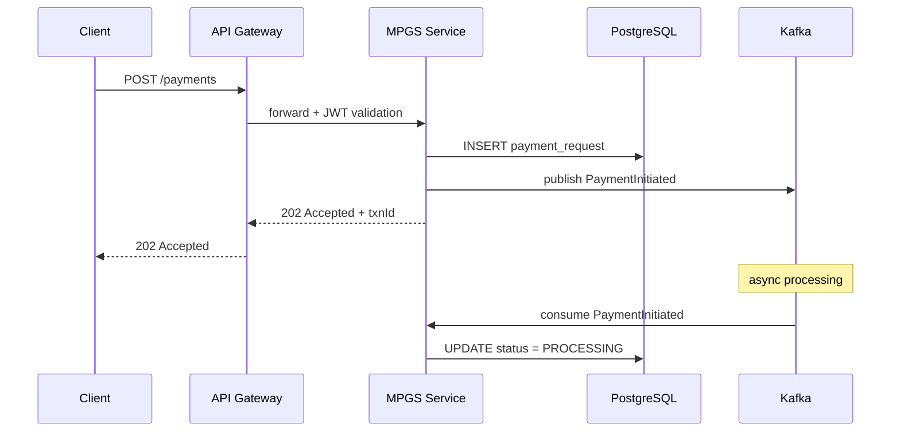
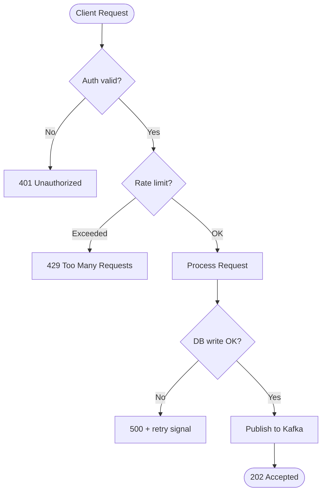
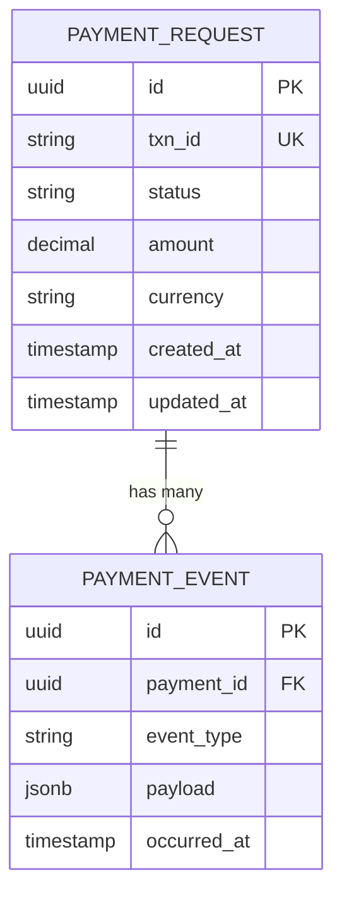
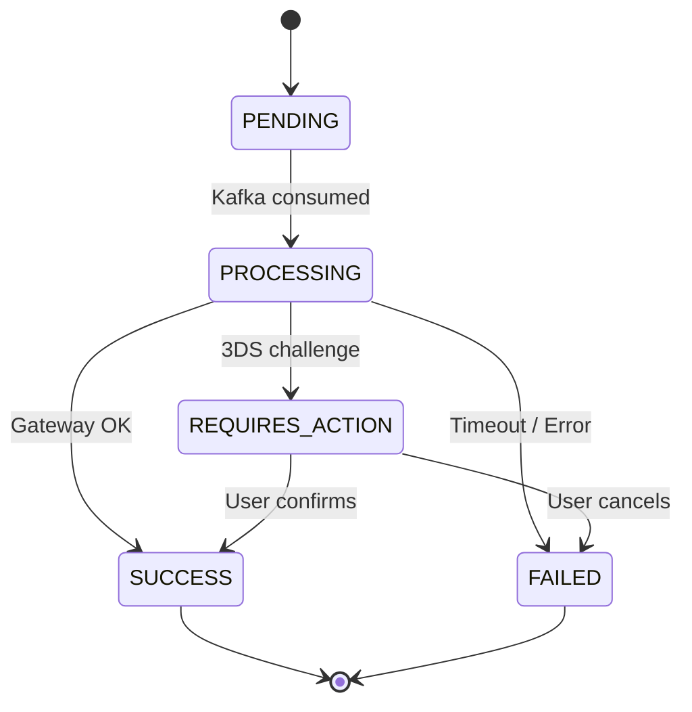
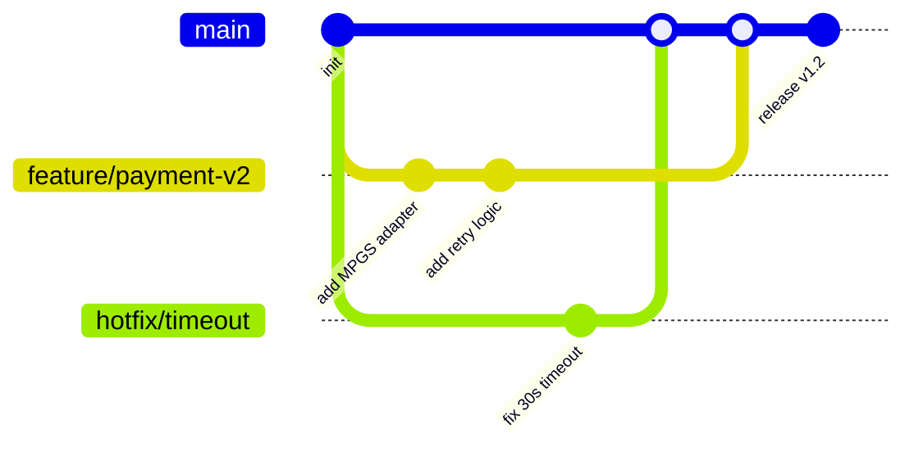

Trang này dùng để test Mermaid diagram rendering. Tất cả diagrams được render client-side, lazy-loaded.

## Sequence Diagram — Payment Flow

## Flowchart — Request Lifecycle

## ER Diagram — Payment Schema

## State Diagram — Payment Lifecycle

## Gitgraph — Feature Branch Strategy

